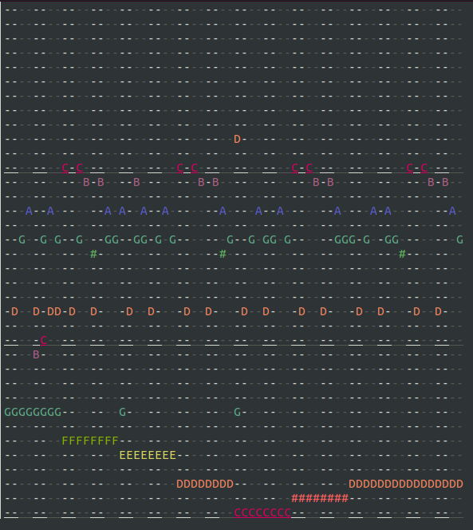

# Terminal Music Sequencer

Terminal-based music sequencer toy.



## Installation

```bash
python3 -m venv venv
. venv/bin/activate
python3 -m pip install -r requirements.txt
```

On some systems PyAudio may require additional steps for setup.
Sorry.
Good luck.

## Usage

```bash
python3 main.py
```

By default songs are saved to and loaded from `song.txt`.
You may change this default with a command line argument:

```bash
python3 main.py songs/duck.txt
```

You may also need to specify a terminal that supports 256 color:

```bash
TERM=xterm-256color python3 main.py
```

## Controls

- Click to place or remove notes
- Spacebar to play the song
- `a` and `d` to scroll
- `s` to save
- `q` to quit
